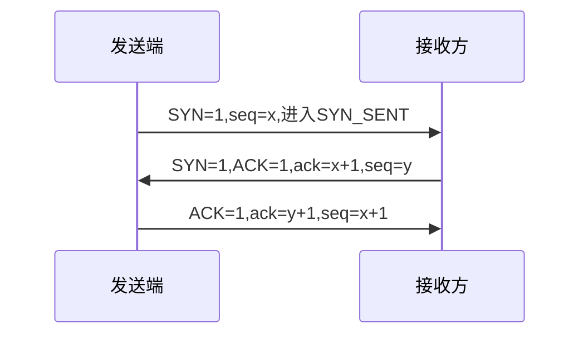
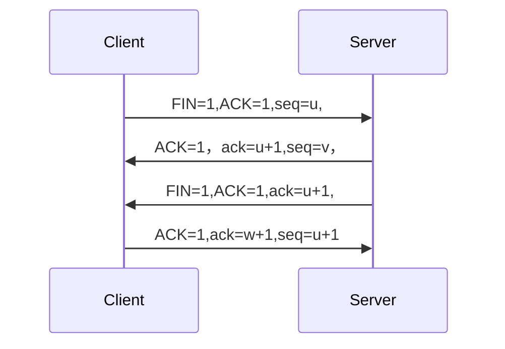

## 	概论

### 名词

#### ISP

> ISP(internet service provider)，互联网服务提供者。

#### IXP

> internet exchange point,互联网交换节点。
>
> 允许两个网络直接相连并快速交换分组

#### www

> world wide web。万维网

####  AN

> access network,接入网，用于ISP将用户接入互联网

#### AS

> Autonomous System
> 自治系统

#### Rip

> router infomation pocotol
>
> 路由信息协议.基于距离(会记录距离)

#### RTT

> Round trip time
> 往返时间

#### TTL

> time to live
> 存活时间

### 互联网组成

> **边缘部分**：连接在互联网的主机构成，这些主机也是端系统
> **核心部分**：网络和连接网络的路由器

### 端系统之间的通信

> **C/S**：client/Sserver，客户/服务器方式
> **P2P**:peer to peer ，对等模式

### 交换技术

* 电路交换
  建立物理连接，连在交换机上，需要时就将两条线连在一起

* 分组交换
  采用存储转发，将数据划分为等长的数据段，为每个数据段添加首部，就是包

  > 问题：需要排队，不保证带宽(动态分配)

* 报文交换
  

### 网络分类

| 类型(按范围)    | 说明 |
| --------------- | ---- |
| WAN(广域网)     |      |
| MAN(城域网)     |      |
| LAN(局域网)     |      |
| PAN(个人局域网) |      |

| 类别(按使用者) | 说明               |
| -------------- | ------------------ |
| 公用网         | 缴费就可以上网     |
| 专用网         | 特殊情况构建的网络 |


### 各层的功能

* 差错控制
* 流量控制
* 分段和重装
* 复用和分用
  将数据流合并为一个，
* 建立连接和释放

### 性能指标

| 指标        | 速率                                                         |
| ----------- | ------------------------------------------------------------ |
| 速率/比特率 | 数据的传输速率，bit/s。通常指额定                            |
| 带宽        | 带宽越高，最高速率越高                                       |
| 吞吐率      | 单位时间通过的实际数据量，受带宽和速率影响                   |
| 时延        | 数据传送所需的时间，由**排队时延，发送时延，传播时延，处理时延**构成 |
| 时延带宽积  | 传播时延*带宽，管道中的比特数表示发出但未到达的比特          |
| 往返时间    | 发送到收到确认的时间                                         |
| 利用率      | 有多少被利用                                                 |

* **时延**

  > **发送时延**：主机/路由器发送数据的时间，=数据长/发送速率
  >
  > **传播时延**：信道长/传播时延
  >
  > **处理时延**：主机/路由器收到分组，进行处理的时间
  >
  > **排队时延**：分组在路由器中输入输出排队的时间， 

## 网络体系结构

> 网络体系结构就是各层和协议的集合
>
> PDU(Protocol Data Unit)：协议数据单元。对等层次之间传送的单元.

### OSI七层分层：

|     | 作用                                                      | 协议                              | 相关东西                   |
| --- | ------------------------------------------------------- | ------------------------------- | ---------------------- |
| 应用层 | 为网络应用提供服务                                               | FTP，HTTP，HTTPS，DHCP<br />TELNET |                        |
| 表示层 | 接收应用层数据，进行翻译，压缩，加密/解密                                   |                                 | 翻译：将数据翻译为计算机能读懂的       |
| 会话层 | 建立、管理和终止会话,解析域名                                         | DNS                             | DNS                    |
| 传输层 | 接收上层数据，根据大小分成段，**每段都有源端口，目标端口，序列号(重组)**，负责端对端。由相关协议更新段。 | UDP(可不可靠传输，更快),,TCP(可靠传输)       | 分段，流量控制，差错控制。          |
| 网络层 | 将数据包发送到另一计算机，                                           | IP ,,ARP(解析IP)<br />rarp，icmp   | 逻辑寻址(寻找ip)， 路由()，路径确定， |
| 链路层 | 将数据包封装成帧，帧头含有源MAC地址，目标MAC地址                             | ARP(广播，映射)                      | 交换机，拓扑，                |
| 物理层 | 帧下沉为比特                                                  |                                 |                        |


### TCP/IP五层分层：

|            | 功能                                                 |                                      |
| ---------- | ---------------------------------------------------- | ------------------------------------ |
| 应用层     | 通过应用进程间的交互来完成特定功能                   |                                      |
| 运输层     | 负责两台主机进程之间的通信<br />具有复用和分用的功能 | UDP：传输用户数据报<br />TCP：报文段 |
| 网络层     | 负责两台主机间的通信。负责**路由选择**和**转发**     |                                      |
| 数据链路层 | 相邻节点的**可靠通信**，出错需要可靠传输协议来纠正   |                                      |
| 物理层     | 比特传输                                             |                                      |


将OSI应用层，会话层，表示层归为应用层。

客户端和服务端数据传输：

输入URL，DNS将其解析为IP地址，产生http请求。也就是报文，报文在传输层封装为段，每段有端口，序列号，由TCP协议与服务器进行三次握手，之后http请求从应用层发出，接收响应报文。然后在网络层加上IP地址封装为包，并由ARP协议将IP地址解析为MAC地址，在这层进行路由，选择路径。然后在链路层加上MAC地址封装为帧，帧沉为比特。之后帧从链路层发出，经拓扑传至服务器，


## 应用层

***

#### http/https

##### 请求报文：

###### 组成：

* 请求行：
  * 请求方法
  * 请求URL
  * HTTP协议及版本
* 请求头：有多个属性，以键值对的形式存在。
* 请求体：

###### 请求方法：

| 方法                        | 作用                                         |
| --------------------------- | -------------------------------------------- |
| GET                         | 向服务器请求资源                             |
| POST                        | 向服务器提交信息，如注册                     |
| PUT                         | 修改服务器数据                               |
| DELETE                      | 删除服务器数据                               |
| OPTIONS                     | 获取目标URI支持的方法                        |
| TRACE（跟踪）               | 回显服务器受到的请求                         |
| CONNECT                     | 建立链接管道，通常用于代理                   |
| HEAD                        | 获得报文首部，常检查是否存在                 |
| $_SERVER["HTTP-custom-head] | 自定义请求头，custom-head.请求头是数组键值， |

head和get区别：head不返回报文主体。

###### 请求头部：

| header          | 作用                                     | 值                                              |
| --------------- | ---------------------------------------- | ----------------------------------------------- |
| Accept          | 指定客户端接受的数据类型                 | HTML，JISON，XML                                |
| Accept-Charset  | 浏览器接受的编码                         |                                                 |
| Accept-Encoding | 客户端能接受的编码类型                   | gzip，*(任何)                                   |
| Accept-Language | 客户端支持的语言                         |                                                 |
| Cache-Control   | 指定客户端的缓存策略                     | no-cache，max-age                               |
| Connection      | 客户端与服务器的链接类型                 | keep-alive，close                               |
| Content-Length  | 请求的内容长度                           | Content-Length: 348                             |
| Content-Type    | 请求的与实体对应的MIME信息               | Content-Type: application/x-www-form-urlencoded |
| Cookie          | 客户端和服务器间传递会话消息，如登录状态 |                                                 |
| Date            | 请求发送的日期和时间                     | Date: Tue, 15 Nov 2010 08:12:31 GMT             |
| Expect          | 请求的特定的服务器行为                   | Expect: 100-continue                            |
| From            | 发出请求的用户的Email                    | From: user@email.com                            |
| Range           | 只请求实体的一部分，指定范围             | Range: bytes=500-999                            |
| Host            | 指定要访问的服务器地址                   | URL                                             |
| Referer         | 指定请求来源网页的URL                    |                                                 |
| X-Forward-for   | 获取真正的ip，而不是代理的ip             | <client,> proxy1   proxy2                       |
| content-type    | 指                                       |                                                 |
| User-Agent      | 标识浏览器的信息                         |                                                 |

###### 请求头伪造：

X-Forwarded-For: 127.0.0.1
X-Forwarded: 127.0.0.1
Forwarded-For: 127.0.0.1
Forwarded: 127.0.0.1
X-Requested-With: 127.0.0.1
X-Forwarded-Proto: 127.0.0.1
X-Forwarded-Host: 127.0.0.1
X-remote-IP: 127.0.0.1
X-remote-addr: 127.0.0.1
True-Client-IP: 127.0.0.1
X-Client-IP: 127.0.0.1
Client-IP: 127.0.0.1
X-Real-IP: 127.0.0.1
Ali-CDN-Real-IP: 127.0.0.1
Cdn-Src-Ip: 127.0.0.1
Cdn-Real-Ip: 127.0.0.1
CF-Connecting-IP: 127.0.0.1
X-Cluster-Client-IP: 127.0.0.1
WL-Proxy-Client-IP: 127.0.0.1
Proxy-Client-IP: 127.0.0.1
Fastly-Client-Ip: 127.0.0.1
True-Client-Ip: 127.0.0.1
X-Originating-IP: 127.0.0.1
X-Host: 127.0.0.1
X-Custom-IP-Authorization: 127.0.0.1

##### 响应报文：

###### 组成：

* 响应行：
  * http协议及版本
  * 状态码
  * 状态码的原因短语
* 响应头：
* 响应体：

###### 响应码

* 1xx

* 3xx 重定向

| 状态码 | 信息                                                         |
| ------ | ------------------------------------------------------------ |
| 301    | 资源永久迁移，当访问旧的url，服务器会指示客户端访问新的url。 |
| 302    | 临时迁移，url1可以跳转url2，还可以跳转url3                   |
| 304    | 访问成功，告诉客户端本地有缓存，直接可以访问，节省资源       |

* 4xx

| 状态码 | 信息                                 |
| ------ | ------------------------------------ |
| 403    | 访问被拒绝(服务器资源不足，权限不够) |
| 404    | 没有该资源                           |


##### cookie & session & token

###### 存储位置：

* Cookie：存储在用户的浏览器中。

* Session：通常存储在服务器端，但会话ID会存储在用户浏览器的Cookie中。
* Token：通常存储在用户浏览器中，例如使用localStorage或sessionStorage。

###### 安全性：

* Cookie：相对较低的安全性，容易被窃取或篡改。
* Session：相对较高的安全性，因为会话数据存储在服务器端。
* Token：取决于实现方式，但通常具有较高的安全性，特别是使用JWT等加密算法的情况。

###### 使用场景：

* Cookie：用于在用户浏览器中存储少量数据，例如跟踪用户偏好、购物车内容等。
* Session：用于在服务器端存储用户会话信息，通常用于跟踪用户的登录状态和其他相关信息。
* Token：通常用于API认证，用于无状态的身份验证和授权。

###### 生命周期管理：

* Cookie：可以设置过期时间，可以长期保存在用户浏览器中。
* Session：通常在用户关闭浏览器或长时间不活动时过期。
* Token：可以设置短暂的过期时间，通常在每次请求中发送到服务器。

***

content-type

> 为了确保客户端和服务器能够正确理解和处理数据

text/html

application/json

application/x-www-form-urlencoded

text/plain

application/xml

##### http和https的区别：

https提供一个安全的环境，数据的传输进行加密。

http没有进行加密。

加密的方法有对称加密和非对称加密。常见的有SSL和XSL加密。

是基于TCP/IP协议的。 


***

#### DNS

#### TELNET

> tcp建立连接，telnet选项协商，数据明文传输，断开连接|

* 选项协商
  iac控制格式：iac+命令+选项
  iac控制以ff开头

  ```cmd
  iac do echo
  #16进制：ff fd 01 表示请求对方启用回显
  ```

* 协商命令
  | 命令 | 16进制 | 说明             |
  | ---- | ------ | ---------------- |
  | do   | 0xfd   | 让对方启用选项   |
  | dont | 0xfe   | 让对方关闭某选项 |
  | will | 0xfb   | 我愿意启用       |
  | wont |        | 我不启用         |
  | sb   | 0xfa   | 开始子协商       |
  | se   | 0xf0   | 结束子协商       |

* 选项
  | 选项              | 16进制 | 说明       |
  | ----------------- | ------ | ---------- |
  | echo              | 0x01   | 是否回显   |
  | SUPPRESS-GO-AHEAD | 0x03   | 抑制ga信号 |
  | TERMINAL-TYPE     | 0x18   | 中断类型   |
  | WINDOW-SIZE       | 0x1f   | 窗口大小   |
  | LINE-MODE         | 0x22   | 行模式     |
  |                   |        |            |

  


***

## 传输层

> 接收上层协议，负责端到端
### 端口


| 协议        | 客户端 | 服务端  | TCP/UDP |
| --------- | --- | ---- | ------- |
| FTP-DATA  | R   | 20   | TCP     |
| FTP       | R   | 21   | TCP     |
| SSH       | R   | 22   | TCP     |
| Telnet    | R   | 23   | TCP     |
| SMTP      | R   | 25   | TCP     |
| DNS       | R   | 53   | UDP/TCP |
| DHCP      | 68  | 67   | UDP     |
| TFTP      | R   | 69   | UDP     |
| HTTP      | R   | 80   | TCP     |
| POP3      | R   | 110  | TCP     |
| RPCbind   |     | 111  |         |
| NTP       | R   | 123  | UDP     |
|           |     | 135  |         |
| IMAP      | R   | 143  | TCP     |
| SNMP      | R   | 161  | UDP     |
| SNMP Trap | R   | 162  | UDP     |
| HTTPS     | R   | 443  | TCP     |
| RDP       | R   | 3389 | TCP     |
|           |     |      |         |

### TCP

> 面向连接
> 可靠传输
> 全双工
> 面向字节流

#### 数据包分析


> 端口
> 确认号：到N-1都以及接收
> 窗口：允许发送的数据量

> * seq:序列号
> * ack:确认号，ack=seq+1，表示下一个期望接收的消息从ack开始
> * ACK：确认标志，表示该报文是一个确认报文
> * SYN：同步序列号，希望一个新的tcp连接

#### 套接字

> socket={IP}:{port}

#### TCP三次握手：

客户端发送SYN包：标识位SYN=1，序列号sqe=x,  client进入SYN_SENT.
服务器收到，进入SYN-RCVD,  发送SYN=1，ACK(用于同步SYN)=1,sqe=x+1,确认号ack=x+1;
client收到后，发送(没有标识位)SYN=0，ACK=1,sqe=x+1,ack=x+2.之后进入ESTABLISHED。



#### 4次挥手

在这个过程中，进行第一次握手后由任何一方发起。想要结束链接的一方发送FIN包。




#### tcp发送时机

* tcp维持一个变量，等于最大报文长度MSS，缓存中的数据达到MSS，就组成一个tcp报文发送
* 由发送方的进程明确发送，--tcp推送
* 计时器，发送方的一个计时器到期。

#### 拥塞控制方法

###### 快恢复算法(FR)

###### 慢开始

###### 拥塞避免

#### 快重传

#### 持续计时器

#### 滑动窗口

> 双方维持发送窗口和接收窗口。

#### SYN -flood攻击

[攻击详解](../ATK&SRC.md#synflood)

半连接：服务器收到Syn包后，链接进入半连接。完成三次挥手后进入全连接。利用大量虚拟ip向服务器发送syn包。服务器回复包，得不到响应，占用大量半连接通道。导致用户无法访问，浪费服务器资源

* 实现算法：

  > 快重传
  > 快恢复
  > 慢开始
  > 拥塞避免

### UDP

> UDP 是无连接的、
> 不可靠的传输协议，
> 它不提供拥塞控制机制
> 面向报文
> 复用和分用(基于端口)

#### 反射攻击

在UDP协议中，正常情况下，客户端发送请求包到服务器，服务器返回响应包给客户端，一次交互就已完成，中间没有校验过程。反射攻击正是利用了UDP协议面向无连接、缺少源认证机制的特点，将请求包的源IP地址篡改为攻击目标的IP地址，最终服务器返回的响应包就会被送到攻击目标，形成反射攻击

#### 放大攻击

NTP(Network Time Proctol)，网络时间协议，用于时间同步，请求包很小，但是响应包很大。利用反射，发送molist请求(返回客户端访问服务端的列表)，本来用于检测那些访问了服务器。

#### 防御

***

## 网络层

***

#### 路由

##### 路由器

> Router。
> 负责连接各个网络。
> 存储路由信息

* 转发表
  存储转发信息

  | 目的 | 跳数 | 下一跳 |
  | ---- | ---- | ------ |
  |      |      |        |

  

* 特殊路由

  > 主机路由
  >
  > 默认路由:不管目的，由指定的路由器转发

##### 路由分类

* 直连路由
  接口接入就添加

* 静态路由

  手动添加

* 动态路由
  

##### 路由选择

* 内部网关协议(同一个自制系统)(IGP)
  如RIP(利用距离向量),OSPF(链路状态)

* 外部网关协议(负责外面不同自治系统之间)(BGP)

  BGP-4

##### Rip

> router infomation procotol

* 内容

  > 一条路径最多15个路由,
  > 距离16标记不可达
  >
  > 相邻路由器会交换所有信息

* 算法

  > A发送rip给B
  >
  > 1. A先把跳数全部加1,下一跳改为自己
  > 2. 没有的,添加
  > 3. 下一跳相同,替换
  > 4. 下一条不同,对比跳数

##### BGP

> [目的,AS1,AS2,IP]

* 路径选择：热土豆

  > 选择在本AS中跳转最少的

***

#### ip地址

> 分为ipv4和ipv6

##### 分类(传统)

| 首字节    |         |      |
| --------- | ------- | ---- |
| 0xxx xxxx | 0~127   | 单拨 |
| 10xx xxxx | 128~191 | 单拨 |
| 110x xxxx | 192~223 | 单拨 |
| 1110 xxxx | 224~239 | 多播 |
| 1111 xxxx | 240~255 |      |

##### ipv4

> 32位二进制。8位一组。

##### ipv6

> 增加到128位

* 报文格式

  > 包含版本,有效载荷长度(最长65535),目标地址,源地址,跳数限制等
  >
  > 跳数为0时丢弃报文

* 记法

  采用16进制冒号记法,16为一组.

  一组中都是0,用一个0取代,无限制

  **零压缩**

  > 只能使用一次零压缩
  >
  > 将连续的0用::代替

####  CIDR

> 无分类域路由选择
>
> 消除传统分类(A,B,C..)。
> 改用网络前缀(多少位是网络号) 斜杠记法127.0.0.1/20，前20位是网络号
>
> 地址块：网络号相同，主机号连续是同一地址块
>
> 地址掩码：
> 32位，网络号处改为1，主机号改为0
> 目的是让计算机迅速算出网络前缀
>
> 可分配的ip：
> 2^n-2。n是32-网络前缀。

#### VLSM

#### DHCP

服务端udp 67端口，客户端udp 68

> 动态主机分配

过程：

1. 广播，
2. dhcp 返回offer，包含的地址池
3. 客户端发送request，请求ip
4. dhcp返回ack。

***

#### IP协议

##### 数据报格式

> 首部是固定20字节。包含ip版本，源地址，目的地址，协议，首部长度，数据报标识等
> 
> 版本号，普遍是4
> 首部长度，ip首部长度，单位是 32bit
> 服务类型，区分服务时使用，基本不使用
> 总长度：数据包总长度(首部+数据)
> 标识，数据包id
> 标志位，占3位。第一位为0，第二位是否分片，0可以，1不能。第三位是否还有分片传输，0表示没有。
> 片偏移：占高13位
> 生存时间：1byte
> 协议：01(ICMP)   06(TCP) 11H(UDP)

##### 交付转交

> 在路由器之间跳转。

* 最长前缀匹配

  > 有多个路由选择时，选择前缀最长的


***

#### ICMP

> internet control message protocol
> 网络控制信息协议
>
> 封装在ip包中
>
> 特殊地址发送icmp

在IP协议的基础上起作用，算是IP协议的补充。IP协议不提供可靠传输。需要ICMP协议来判断IP包是否成功传输到

作用：

* 确认IP包是否成功达到
* 通知发送过程中IP包丢弃的原因

格式：


* 类型：

  <table border="1" cellpadding="6" cellspacing="0" align="center">
    <tr>
      <th>Type</th>
      <th>Code</th>
      <th>描述</th>
      <th>类别</th>
    </tr>
    <tr>
      <td>0</td>
      <td>0</td>
      <td>回显应答（Ping Reply）</td>
      <td rowspan="10">查询报文</td>
    </tr>
    <tr>
      <td>8</td>
      <td>0</td>
      <td>请求回显（Ping Request）</td>
    </tr>
    <tr><td>9</td><td>0</td><td>路由器通告</td></tr>
    <tr><td>10</td><td>0</td><td>路由器请求</td></tr>
    <tr><td>13</td><td>0</td><td>时间戳请求（已不使用）</td></tr>
    <tr><td>14</td><td>0</td><td>时间戳应答（已不使用）</td></tr>
    <tr><td>15</td><td>0</td><td>信息请求（已不使用）</td></tr>
    <tr><td>16</td><td>0</td><td>信息应答（已不使用）</td></tr>
    <tr><td>17</td><td>0</td><td>地址掩码请求</td></tr>
    <tr><td>18</td><td>0</td><td>地址掩码应答</td></tr>
    <tr>
      <td rowspan="11">3<br>目的不可达</td>
      <td>0</td>
      <td>网络不可达</td>
      <td rowspan="21">差错报文</td>
    </tr>
    <tr><td>1</td><td>主机不可达</td></tr>
    <tr><td>2</td><td>协议不可达</td></tr>
    <tr><td>3</td><td>端口不可达</td></tr>
    <tr><td>6</td><td>目的网络不认识</td></tr>
    <tr><td>7</td><td>目的主机不认识</td></tr>
    <tr><td>9</td><td>目的网络被强制禁止</td></tr>
    <tr><td>10</td><td>目的主机被强制隔离</td></tr>
    <tr><td>11</td><td>由于 TOS，网络不可达</td></tr>
    <tr><td>12</td><td>由于 TOS，主机不可达</td></tr>
    <tr><td>13</td><td>由于过滤，通信被强制禁止</td></tr>
    <tr>
      <td>4<br>源抑制</td>
      <td>0</td>
      <td>源端被关闭</td>
    </tr>
    <tr>
      <td rowspan="4">5<br>ICMP 重定向</td>
      <td>0</td>
      <td>对网络重定向</td>
    </tr>
    <tr><td>1</td><td>对主机重定向</td></tr>
    <tr><td>2</td><td>对服务类型和网络重定向</td></tr>
    <tr><td>3</td><td>对服务类型和主机重定向</td></tr>
    <tr><td rowspan="2">11<br>TTL 为 0</td><td>0</td><td>传输期间生存时间为 0</td></tr>
    <tr><td>1</td><td>在数据报组装期间生存时间为 0</td></tr>
    <tr>
      <td rowspan="2">12<br>报文格式错误</td>
      <td>0</td>
      <td>坏的 IP 首部</td>
    </tr>
    <tr><td>1</td><td>参数问题</td></tr>
    </table>
  
  
  
  


  


***

#### IGMP

> internet group management protocol
> 网际组管理协议

，#### NAT

> network Address Translation
> 网络地址转换。
> 将内网ip经由网关，源ip替换为公网ip。

* NAPT

  > 网络地址与端口转换，
  > 在NAT的基础上添加了端口的转发

#### ARP

> address resolution protocol(地址解析协议)
> 在三层中，将ip转为mac地址，原理是主机/三层交换机有一个ip/mac地址映射表。
> 在二层中，包以arp帧的形式传播。

* 

***

## 链路层

### 概念

* 链路
  无源的点对点的物理路线
* 数据链路
  控制传输的协议的软硬件+链路
  用网络适配器，即网卡实现
* 以太网信道利用率
  
  > S=1/(1+a)
  > a=以太网单程端到端时延/发送时延T

### 3个基本问题

#### 封装成帧

> 在数据前后加首部尾部。首尾部有定界符，区分数据和首尾部

#### 透明传输

> 透明指某个事物看起来不存在，用来解决把数据中的二进制恰巧作为EOT/SOH，导致出错的问题

* 实现

  > 字节填充

#### 差错控制

> 在传输过程，可能某个bit出错。占比是误码率

* 解决：

  > CRC 循环冗余检测
  >
  > 
  >
  > 在数据后面添加帧检验序列FCS(由CRC得来)

### PPP协议

> Point to point。

* 组成：

  > 1. 将ip封装到链路的方法
  > 2. 链路控制协议(LCP)
  > 3. 网络控制协议(NCP)

* 透明传输问题

  > 异步传输：字节填充
  > 同步传输：零比特填充

### CSMA/CD协议

* 背景

> 早期计算机都是连在一根总线上，目的地址和适配器一致才接收。

* 采用措施

  > 1. 采用无连接工作，不需要建立连接再发送。
  > 2. 使用曼彻斯特编码进行传输

* 减小冲突CSMA/CD协议

  > carrier sense multiple access with collision detecion：载波监听多点接入/碰撞检测
  >
  > **多点接入**：总线型网络，计算机多点接入
  >
  > **载波监听**：发送数据时，监听信道，空闲时才发送数据
  >
  > **碰撞检测**：检测是否发生碰撞。如果发生，停止发送，过段时间再尝试发送

* 碰撞后重传时机

  > 用截断二进制指数退避
  >
  > 计算：
  > **基本退避时间**：t
  > **冲突次数**：k
  > **r**:{0,1,2.....(2^k-1)}中的一个数
  > **重传时延**：T=t*r
  >
  > 当k=16任然碰撞，停止。
  >
  > 以太网最小有效帧为**64**byte。小于的都是无效帧，丢弃

### MAC地址

> 48位(24厂商编号，后24主机编号)
> 组织唯一标识符：前3字节是分配的标识符
> 扩展唯一标识符：后3字节是厂家自行分配
>
> 最低位是I/G位，
> I/G：0-->单播  00:Ff:ff:Ff:ff:ff
> I/G：1-->组播  01:ff:ff:ff:FF:ff
> 48位全为一：广播

### mac表

> 二层交换机中，记录mac地址和端口之间的关系。
>
> ```powershell
> display mac-address #华为交换机 查看mac表
> ```
>

### VlAN

一个网中，多个交换机连接，网中电脑太多，导致广播风暴。为了解决主机太多，进行划分，采用vlan技术分隔

> 将连接分为两个：
>
> * 接入链路(Access Link)
>   连接的是主机
> * 干道链路(Turnk Link)
>   连接的是交换机

#### 原理：

> ACC接口，只接收有对应标签的数据，

#### 划分方法

* 基于端口划分
  
* 基于mac划分
  
* 基于ip
  
* 基于协议
  
* 基于策略

### 物理层扩展以太网


### 链路层扩展以太网

### 虚拟局域网

> 是提供的一种服务。

* 划分的方法

  > * 端口，交换机

### 交换机

* 以太网交换机

  > 相当于多接口网桥。
  > 采用全双工通信
  > 具有并行性。每个用户都是N的带宽，集线器是要均分
  >
  > 采用存储转发

* 自学习功能
  为了消除回路，采用生成树协议(STP)

### 集线器

> 以太网中，双绞线采用星型拓扑。星型拓扑中心由集线器。传统是同轴总线型。
>
> 主机接入集线器，逻辑上还是总线型，只是用集线器模拟线。

### 帧结构


### arp协议


> 
>
> 目标地址：ffff ffff ffff，广播地址
> 源地址
> 0806：帧类型，arp协议
> 00 01硬件类型，以太网
> 08 00：上层协议类型，ipv4
> 06：硬件地址长度，
> 04：协议地址长度，ipv4 4字节
> 00 01 ：操作码，1为请求 2为响应
> 54 89 ca 0b 发送方硬件地址
> 01 01 01 01 发送方协议地址
> ffff ffff ffff ffff 接收方硬件地址
> 01 0101 02 ：接收方协议地址

* 攻击

  > arp欺骗
  > 防止

  > arp泛洪

***

## 物理层

### 传输介质

* 双绞线

> * RJ45
>
>   T568A，1-2.。2-6
>   T568B ：橙白，橙，绿白，蓝，蓝白，绿，棕白，棕
>
> * RJ11
>
> 直通线：连接不同设备
> 交叉线：连接同种设备
>
> 

###  传播媒体

* 引导型
  固体
* 非引导型
  自由空间

### 常用术语

* 信道
  传送信息的媒体

* 单工通信
  通信是单向的

* 双向交替通信(半双工通信)
  双向，不能同时发送

* 全双工通信
  可以同时发送和接收

* 基带信号
  来自发送源

* 调制
  | 方法 |      |
  | ---- | ---- |
  | 调幅 |      |
  | 调频 |      |
  | 调相 |      |

  | 类别     | info                               |
  | -------- | ---------------------------------- |
  | 基带调制 | 对基带信号进行变换，这个过程是编码 |
  | 带通调制 | 将低频转为高频                     |

* 编码
  | encode       | 说明                              |            |
  | ------------ | --------------------------------- | ---------- |
  | 不归0        | 正为1，负为0                      | 没有自同步 |
  | 归0制        | 正为1，负为0，但是码原前后都会归0 |            |
  | 曼彻斯特     | 中心向上为0.向下为1               | 有自同步   |
  | 差分曼彻斯特 | 在开始有跳变为0，没有为1          | 自同步     |

   

### 信道容量

> 信道极限容量和能通过的**频率范围**和**信噪比**有关

* 信噪比

  > 信号的平均功率和噪声的平均功率之比(S/N)。单位dB
  > 公式：信噪比=10log10(S/N)

* 信道极限速率：
  香龙公式：C=Wlog2(1+S/n) 

  > w是带宽，

* 提高速率的方法

  1. 用编码的方法携带更多信息

### 信道复用

> 允许用户使用一个共享信道进行通信

#### 频分复用

> FDM
> 将宽带分为多份，分配频率后就用这个频率进行通信

#### 时分复用

> TDM
>
> 将时间划分等长的时分复用帧。每个帧中有固定序号。这个序号周期性出现
>
> 分配的时隙，当用户没有使用时，这个时隙只能空着

#### 统计时分复用

> STDM
>
> 按需分配时隙

#### 波分复用

> 光的频分复用

#### 码分复用

> CDMA
>
> 用户可以同时使用同一个频带,因为使用不同的码型

* 每个站分配的码片序列不同，但是必须正交。

#### 频分多址

> 用户各使用一个频带，或者轮流使用这个频带

***


## 网络协议


#### DICT

> 用于远程访问词典的协议。
> 一般运行在2628端口上

原理：

> 1.采用TCP/IP链接。远程链接DICT服务器
> 2.dict://URL.向服务器发送查询请求。
>
> 浏览器很少支持DICT，需要借助工具使用该协议

查询:

> dict://hostname[:port]/word

***

#### SSH

> **安全外壳协议**用于安全远程访问计算机
> 端口22

##### 登录过程：

###### 密码登录

> ssh username@hostname
> <password


> 将公钥放到server端，密钥并不会通过网络传输

###### 公钥登录


###### 中间人攻击


##### 远程命令执行

登录时附带命令：

> ssh user@hostname "pwd"
> 需要多条命令就用分号隔开：
> ssh user@host "pwd;ls;ifconfig"

执行交换命令：


***

#### [SSL](https://blog.csdn.net/qq_38265137/article/details/90112705?ops_request_misc=%257B%2522request%255Fid%2522%253A%2522DC535583-5DEB-4852-987C-0EA192CE20C7%2522%252C%2522scm%2522%253A%252220140713.130102334..%2522%257D&request_id=DC535583-5DEB-4852-987C-0EA192CE20C7&biz_id=0&utm_medium=distribute.pc_search_result.none-task-blog-2~all~top_positive~default-1-90112705-null-null.142^v100^pc_search_result_base5&utm_term=SSL&spm=1018.2226.3001.4187)&[TSL]()

> SSL(Secure Sockets Layer).
> 保障web通讯的安全。提供私密性，信息完整，身份认证。
>
> SSL是一个不依赖平台/程序的协议，位于Tcp/IP与各种协议之间。保证安全

##### 结构：


* ###### SSL握手协议

  是SSL协议的核心，在建立TCP/UDP链接之后，会进行SSL握手。确保信息安全。

  

  * client hello
    包含SessionID，随机数等

***

#### FTP

> 采用client-server模型。通过TCP/IP进行通信
> 端口21(控制链接)，20(数据传输)

##### 过程

> 链接：向21端口发出链接请求，建立链接后，client发送FTP命令。
> 传输：FTPserver和client之间段都建立的一个链接。

##### 安全性

FTP是明文传输。所以有下面的加密变体：

* FTPS

  > 采用**SSL/TLS**加密

* STFP

  > 依赖**SSH**

***

#### gopher

基于目录和文件层次，让用户浏览目录来回去信息。页面非常简单。因为不支持多媒体。被淘汰

> 使用70端口。
>
> 支持发出GET. POST请求

限制：


> --wite-curlwrappers利用curl打开url流

##### 格式：

> gopher://<host>:<port>/【gopher_path】_str

* 因为gopher不会传输第一个字符，所以要填充一个字符。
* 回车换行需要%0d%0a。参数之间的&。？空格也需要URL编码

##### 用gopher发送http包

* ###### GET

  > 一个GET包：
  > GET /ssrf/test.php?name=becorn HTTP/1.1
  > host:192.168.30.135

gopher：

> curl gopher://192.168.30.135:8080/
> _GET%20/ssrf/test.php%3fname=becorn%20HTTP

* POST
  >POST /ssrf/test.php HTTP/1.1
  >host:192.168.30.135
  >Content-Type:application/x-www-form-urlencoded
  >Content-Length:11
  >
  >
  >name=becorn

* 和GET请求相比，POST的gopher需要有host，Content-Type,Length

gopher:

> curl gopher://192.168.30.135:8080/_POST%20/ssrf/test.php/%20HTTP/1.1%0d%0ahost:192.168.30.135%0d%0aContent-Type:application/x-www-form-urlencoded%0d%0aContent-Length:11%0d%0aname=becorn%0d%0A


***

#### REP

> REP(Robots Exclusion Protocal)，拒绝蜘蛛协议

**robots.txt**
搜索引擎通过robot（spider）自动访问web网页。

> 遵循ERP，位于网站根目录下。规定哪些目录可以爬虫访问，哪些不可以
> 由多条规则组成

* 字段：
  * User-agent：指定爬虫，*表示所有爬虫
  * Disallow：指定哪些路径不被访问
  * Allow:指定哪些路径可以被访问。
  * Sitemap:sitemap文件链接

#### SMB协议

> 用于在
